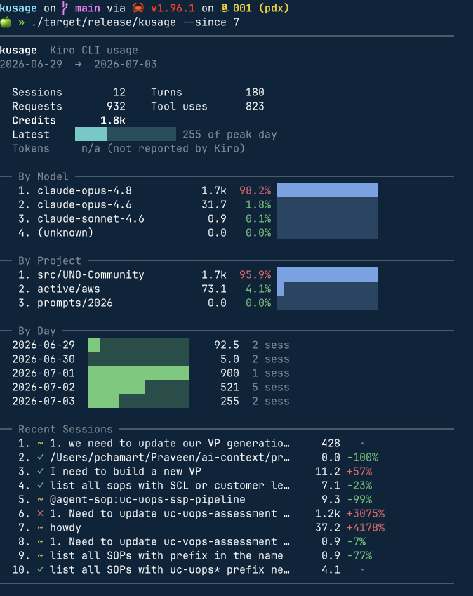

<div align="center">

# kusage

**See how much you're using Kiro CLI, right from your terminal.**

A local, fast Rust CLI that turns [Kiro CLI](https://kiro.dev)'s session data into a compact, professional usage dashboard: sessions, turns, requests, tool uses, and credits, broken down by model, project, and day.

[](LICENSE)
[](https://www.rust-lang.org)
[](#privacy)



</div>

---

## Why kusage

Kiro CLI tracks your usage locally, but there's no easy way to *see* it. `kusage` reads that local data and shows it as a calm, information-dense dashboard, so you can answer questions like:

- How many credits did I burn this week, and on which days?
- Which model and which project is driving most of my usage?
- What were my recent sessions, and did they succeed?

It's inspired by [ccusage](https://github.com/ccusage/ccusage) for the concept and by `rtk`'s history view for the look. Everything runs **locally**: no network calls, no telemetry, no writing back to Kiro's data.

## Install

Requires [Rust](https://rustup.rs) 1.75 or newer.

```bash
# Install from crates.io (once published)
cargo install kusage

# Or install from a local checkout
git clone https://github.com/praveenc/kusage
cd kusage
cargo install --path .
```

That puts a `kusage` binary on your `PATH`. Prefer not to install? Build a release binary and run it in place:

```bash
cargo build --release
./target/release/kusage
```

## Quick start

Just run it:

```bash
kusage
```

Focus on the last week, or trim the tables:

```bash
kusage --since 7        # only the last 7 days
kusage --top 5          # show the top 5 rows in each section
kusage --since 30 --top 8
```

## What you get

The dashboard has five sections, each designed to be readable at a glance:

| Section | What it shows |
| --- | --- |
| **Summary** | Total sessions, turns, requests, tool uses, and credits, with a bar comparing your latest day to your busiest. |
| **By Model** | Which models you use most, ranked by credits, with an impact bar and a color-coded share. |
| **By Project** | Same ranking, grouped by the working directory each session ran in. |
| **By Day** | A day-by-day mini-bar timeline of credit usage. |
| **Recent Sessions** | Your latest sessions in reverse-chronological order, with a status glyph and the change in credits versus the previous session. |

Status glyphs in the recent feed:

| Glyph | Meaning |
| --- | --- |
| `✓` | Completed normally |
| `~` | Cancelled or interrupted |
| `✗` | Ended in an error |

<details>
<summary>Example output (plain text)</summary>

```
────────────────────────────────────────────────────────────────────────
kusage  Kiro CLI usage
2026-06-29  →  2026-07-03

  Sessions        12    Turns          178
  Requests       917    Tool uses      812
  Credits       1.7k
  Latest    ████░░░░░░░░░░░░ 223 of peak day
  Tokens     n/a (not reported by Kiro)

── By Model ────────────────────────────────────────────────────────────
   1. claude-opus-4.8           1.7k  98.1% ████████████████
   2. claude-opus-4.6           31.7   1.8% ░░░░░░░░░░░░░░░░
   3. claude-sonnet-4.6          0.9   0.1% ░░░░░░░░░░░░░░░░

── By Project ──────────────────────────────────────────────────────────
   1. work/service-api          1.7k  95.8% ████████████████
   2. home/dotfiles             73.1   4.2% █░░░░░░░░░░░░░░░

── By Day ──────────────────────────────────────────────────────────────
  2026-06-29  ██░░░░░░░░░░░░░░    92.5  2 sess
  2026-06-30  ░░░░░░░░░░░░░░░░     5.0  2 sess
  2026-07-01  ████████████████     900  1 sess
  2026-07-02  █████████░░░░░░░     521  5 sess
  2026-07-03  ████░░░░░░░░░░░░     223  2 sess

── Recent Sessions ─────────────────────────────────────────────────────
   1. ✓ add pagination to the users endpoint      21.4   +12%
   2. ~ refactor the auth middleware               9.3   -57%
   3. ✗ migrate the config loader                  1.2    -87%
────────────────────────────────────────────────────────────────────────
```

</details>

## Options

```
kusage [OPTIONS]
```

| Flag | Description | Default |
| --- | --- | --- |
| `--since <DAYS>` | Only include usage from the last N days | all history |
| `--top <N>` | Limit ranked breakdowns and the recent feed to N rows | `10` |
| `--json` | Emit machine-readable JSON instead of the dashboard | off |
| `--plain` | Disable colors and the banner (plain text) | off |
| `-h`, `--help` | Print help | |
| `-V`, `--version` | Print version | |

### Scripting with `--json`

`--json` prints a stable, structured report you can pipe into other tools:

```bash
# Total credits over the last 30 days
kusage --since 30 --json | jq '.summary.credits'

# Your top model by credits
kusage --json | jq -r '.by_model[0].label'
```

Colors are also disabled automatically when output is not a terminal or when `NO_COLOR` is set, so piping to a file or another program always yields clean text.

## Where the data comes from

Kiro CLI stores each chat session as a JSON file at:

```
~/.kiro/sessions/cli/<session-uuid>.json
```

Each file records per-turn metadata: credit metering, request and tool-use counts, timing, how the turn ended, and the model in use. `kusage` reads these files **read-only** and aggregates them. It never modifies Kiro's data.

If your Kiro home lives somewhere else, point `kusage` at it:

```bash
export KIRO_DIR=/path/to/your/.kiro   # kusage reads $KIRO_DIR/sessions/cli
kusage
```

### Credits, not tokens

Kiro reports cost as **credits** (each model has a rate multiplier), not raw token counts. The token fields exist in Kiro's data but aren't populated yet, so `kusage` shows `Tokens: n/a` until Kiro starts reporting them. Credits are the headline cost metric everywhere in the dashboard.

## Privacy

`kusage` is entirely local:

- No network calls, ever.
- No telemetry or analytics.
- Read-only: it never writes to Kiro's session data.

The only files it reads are your local Kiro session JSON files.

## Scope

- **In:** read-only local parsing, aggregation by model / project / day / session, the dashboard, a `--json` mode, and flags for time window, top-N, and plain output.
- **Not yet (v1):** no network features, no telemetry, no watch/live mode, no export beyond `--json`.

## Contributing

Issues and pull requests are welcome. To work on `kusage`:

```bash
cargo build            # build
cargo test             # run the test suite
cargo clippy           # lint
cargo fmt              # format
```

## License

[MIT](LICENSE) © Praveen Chamarthi
